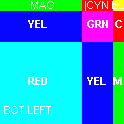

Synopsis
--
Project generates the negative of images out of
uncompressed bitmap files. To do so it
parses only the relevant fields of
BITMAPINFOHEADER and may not be fully compatible with later
versions of headers. For later versions of
header, output file that is generated is
valid, but may not be displayed as intended.

Setup and Run
--
This project was written in Scala and was developed
in IntelliJ IDE. The easiest way to run it is to import
the root folder in the same environment and create a
running configuration. Configuration should specify
the input file as the first command line argument
and output file as the second (default is `data/out.bmp`).

Alternatively install
[sbt](https://www.scala-sbt.org/download.html)
and while in the root folder run the following to compile the
project

    $sbt compile

To run it use the following.

    $sbt "run data/FLAG_B24.BMP"

> Notice that on Windows
  shells the previous command generates error,
> but it works on a Bash shell that runs on Windows OS.

To specify input and output (if non default) run

    $sbt "run data/FLAG_B24.BMP data/out.bmp"

Folder `data` has a few more example files.

__Example of Input BMP image__

__Example of Output BMP image__

